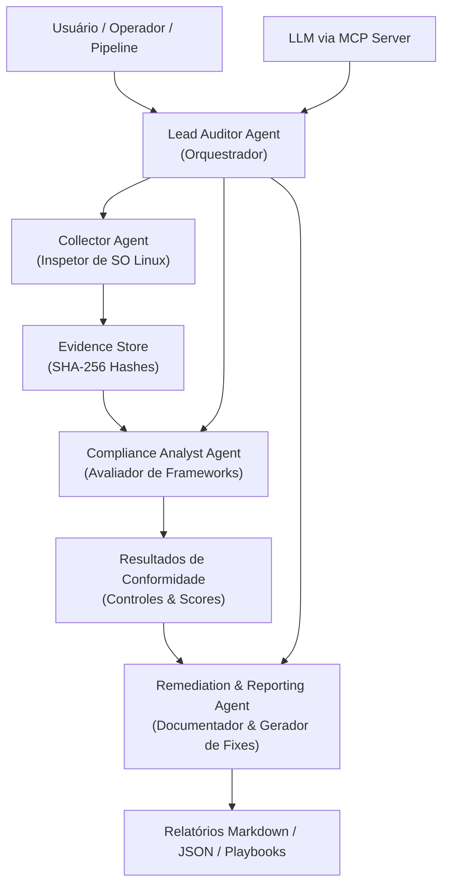
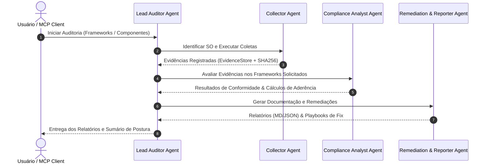

# Agentes de Arquitetura e Modelo Multi-Agente

Este documento define os papéis, responsabilidades, ferramentas e fluxos de interação dos agentes especializados que compõem o ecossistema da plataforma **Linux Security Assessment & Compliance Automation**.

---

## 🤖 1. Catálogo de Agentes Especializados

---

## 📋 2. Definição Detalhada dos Agentes

### 2.1. Lead Auditor Agent (Orquestrador)
- **Função**: Atuar como o ponto central de coordenação do ciclo de vida da auditoria.
- **Responsabilidades**:
  1. Interpretar parâmetros recebidos via CLI, MCP Server ou chamadas de agentes superiores (ADK2).
  2. Determinar o contexto do sistema através do `OSDetector`.
  3. Planejar o roteiro de execução (coletas necessárias, adaptadores disponíveis e frameworks selecionados).
  4. Orquestrar o repasse de evidências para os analistas de conformidade e a geração final de relatórios.
- **Ferramentas Utilizadas**: `sec_audit_linux.core.engine.AuditEngine`, `OSDetector`, `EvidenceStore`.

---

### 2.2. Collector Agent (Inspetor de SO Linux)
- **Função**: Executar coletas de baixo nível no sistema operacional Linux com foco em não-repúdio e segurança.
- **Responsabilidades**:
  1. Inspecionar arquivos de configuração em `/etc` (SSH, PAM, Sudoers, Repositórios, Sysctl).
  2. Consultar o estado do Kernel e subsistemas (`/proc`, `/sys`, `sysctl`, `systemd`).
  3. Analisar regras ativas de firewall (`nftables`, `iptables`, `ufw`), sockets (`ss`) e processos.
  4. Executar adaptadores de ferramentas especializadas (*Lynis*, *OpenSCAP*, *AIDE*, *osquery*, *Trivy*).
  5. Gerar `EvidenceRecord` com timestamp, saída bruta e hash criptográfico SHA-256.
- **Diretrizes de Segurança**: Operação estritamente *read-only*, timeouts rígidos e tratamento de exceções de permissão.

---

### 2.3. Compliance Analyst Agent (Avaliador de Frameworks)
- **Função**: Correlacionar evidências técnicas com os requisitos normativos e calcular os índices de aderência.
- **Responsabilidades**:
  1. Avaliar as evidências contra os 8 frameworks suportados:
     - **CIS Benchmarks** (L1/L2)
     - **CIS Controls v8** (IG1/IG2/IG3)
     - **NIST CSF 2.0**
     - **NIST SP 800-53 Rev 5**
     - **ISO/IEC 27001:2022**
     - **PCI DSS v4.0**
     - **MITRE ATT&CK** (Linux Matrix)
     - **SCAP / SSG**
  2. Aplicar a fórmula de cálculo específica de cada framework.
  3. Classificar o status dos controles (*Compliant*, *Non-Compliant*, *Partial*, *Not Applicable*, *Manual Check*).
  4. Atribuir criticidade aos desvios detectados (*Critical*, *High*, *Medium*, *Low*, *Info*).

---

### 2.4. Remediation & Reporting Agent (Documentador & Gerador de Fixes)
- **Função**: Sintetizar as descobertas em artefatos claros para humanos, agentes e sistemas de remediação.
- **Responsabilidades**:
  1. Gerar o **Relatório Executivo em Markdown** (visão estratégica, gráficos de maturidade e top riscos).
  2. Gerar o **Relatório Técnico Detalhado em Markdown** (evidências brutas, justificativas e comandos de correção).
  3. Gerar o **Payload JSON Estruturado** para ingestão por LLMs, MCP clients, SIEMs ou ADK2.
  4. Produzir **Playbooks de Remediação** (scripts Bash e Ansible) para os controles não aderentes.

---

## 🔄 3. Fluxo de Trabalho Integrado

