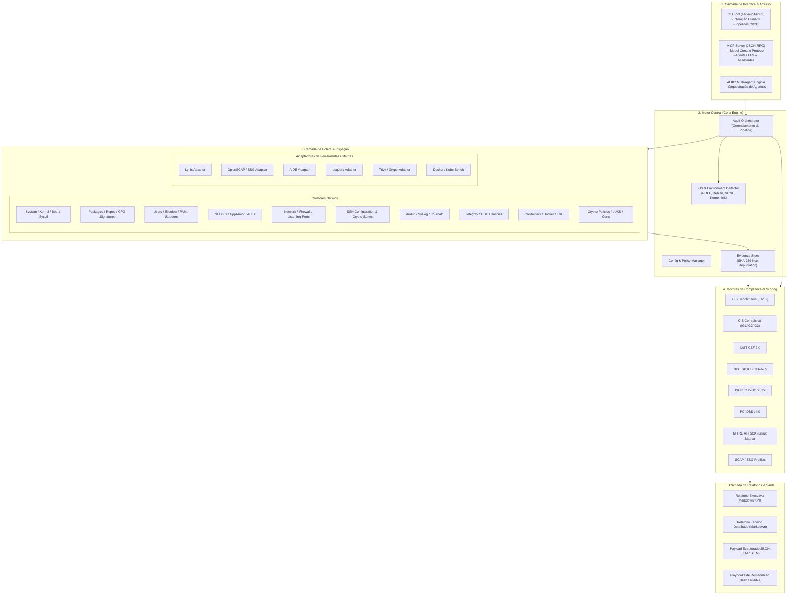
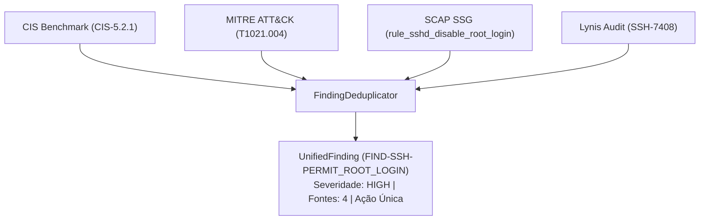

# Arquitetura Técnica do Sistema

Este documento define a arquitetura, padrões de projeto, modelo de dados e o fluxo operacional da plataforma **Linux Security Assessment & Compliance Automation**.

---

## 1. Visão Geral da Arquitetura

O sistema é projetado para auditar configurações, coletar evidências técnicas, validar conformidade com múltiplos frameworks regulatórios e de segurança, e gerar documentação e relatórios para consumo humano e por modelos de linguagem (LLMs).

### Diagrama de Blocos Arquitetural



---

## 2. Camadas do Sistema

### 2.1. Camada de Interfaces
- **CLI (`sec-audit-linux`)**: Ponto de entrada para operadores humanos, administradores de sistemas e pipelines de CI/CD. Suporta execução total, por framework ou por componente.
- **MCP Server (`mcp_server.py`)**: Implementação do protocolo *Model Context Protocol* sobre JSON-RPC (stdio/SSE), permitindo que agentes LLMs executem auditorias, inspecionem controles e obtenham sugestões de remediação.
- **Integração ADK2**: Suporte a ecossistemas multi-agentes para automação avançada de incidentes e conformidade contínua.

### 2.2. Core Engine
- **OS Detector**: Analisa `/etc/os-release`, `/proc/version`, gerenciadores de pacotes e init systems para identificar a família da distribuição (*RHEL/CentOS/Rocky/Alma/Oracle*, *Debian/Ubuntu*, *SUSE/openSUSE*).
- **Audit Orchestrator**: Coordena a fila de inspeções, despachando tarefas para os coletores apropriados com base no SO e nos frameworks solicitados.
- **Evidence Store**: Registra cada evidência com timestamp ISO 8601, comando executado, saída bruta (stdout/stderr) e hash SHA-256 para não-repúdio.

### 2.3. Camada de Coleta & Integração
- **Coletores Nativos**: Módulos em Python que realizam leitura segura e parsing de arquivos de configuração, chamadas de sistema, estados do kernel e saídas de utilitários nativos.
- **Adaptadores de Ferramentas**: Executam ferramentas de terceiros (quando disponíveis) e convertem suas saídas proprietárias em modelos unificados de evidência. Caso uma ferramenta não esteja instalada, o sistema realiza o fallback automático para a auditoria nativa.

### 2.4. Motores de Framework & Cálculo de Aderência
Cada framework é representado por um módulo independente que implementa a interface `BaseFramework`. O módulo contém:
1. Mapeamento de controles técnicos para coletores de evidências.
2. Critérios de avaliação (*Compliant, Non-Compliant, Partial, Not Applicable, Manual Check*).
3. Algoritmo de cálculo de aderência percentual específico do framework.

### 2.5. Camada de Relatórios
- **Markdown Executivo**: Sumário de postura, KPIs de aderência por framework, gráfico de maturidade e principais desvios críticos.
- **Markdown Técnico**: Detalhamento controle a controle, incluindo evidência bruta, justificativa de risco e comando de remediação.
- **JSON Padronizado**: Estrutura de dados enriquecida para consumo por LLMs, SIEMs e ferramentas de GRC.

---

## 3. Modelo de Dados Unificado

### 3.1. Entidades Principais

```
+-------------------+       1..* +-------------------+       1..* +-------------------+
|  AssessmentResult |<---------->|  FrameworkResult  |<---------->| ControlEvaluation |
+-------------------+            +-------------------+            +-------------------+
        |                                                                   |
        | 1                                                                 | *
        v                                                                   v
+-------------------+                                             +-------------------+
|   SystemContext   |                                             |   EvidenceRecord  |
+-------------------+                                             +-------------------+
```

#### `SystemContext`
Contém os metadados do ambiente auditado:
- `hostname`, `ip_addresses`, `os_family`, `os_name`, `os_version`, `kernel_release`, `architecture`, `init_system`, `virtualization`, `scan_timestamp`.

#### `EvidenceRecord`
Registro imutável de uma coleta técnica:
- `evidence_id`: UUID único.
- `collector_name`: Nome do coletor que originou a evidência.
- `target_item`: Arquivo, sysctl, serviço ou recurso auditado.
- `command_executed`: Comando executado (se aplicável).
- `raw_output`: Saída de texto bruta coletada.
- `parsed_data`: Dicionário com os dados estruturados pós-parsing.
- `sha256_checksum`: Hash SHA-256 do conteúdo coletado.
- `collected_at`: Data e hora da coleta.

#### `ControlEvaluation`
Resultado da avaliação de um controle específico:
- `control_id`: Identificador no framework (ex: `CIS-1.1.1`, `NIST-AC-2`, `PCI-8.2.1`).
- `framework_name`: Identificador do framework.
- `title`: Título do controle.
- `status`: `COMPLIANT`, `NON_COMPLIANT`, `PARTIAL`, `NOT_APPLICABLE`, `MANUAL_CHECK`, `ERROR`.
- `severity`: `CRITICAL`, `HIGH`, `MEDIUM`, `LOW`, `INFO`.
- `weight`: Peso do controle para a fórmula de aderência.
- `expected_condition`: Condição esperada de segurança.
- `actual_condition`: Condição observada no sistema.
- `evidence_refs`: Lista de IDs de `EvidenceRecord`.
- `remediation`: Passos e comandos para correção.
- `rationale`: Justificativa de segurança e impacto do desvio.

#### `FrameworkResult`
Consolidação do resultado por framework:
- `framework_name`: Nome do framework.
- `adherence_percentage`: Percentual de aderência (0.0 a 100.0%).
- `total_controls`: Quantidade total de controles aplicáveis.
- `compliant_count`: Controles aderentes.
- `non_compliant_count`: Controles não aderentes.
- `partial_count`: Controles parcialmente aderentes.
- `manual_count`: Controles que necessitam de revisão manual.
- `evaluations`: Lista de `ControlEvaluation`.

---

## 4. Fórmulas de Cálculo de Aderência por Framework

| Framework | Método de Cálculo | Regra de Ponderação |
| :--- | :--- | :--- |
| **CIS Benchmarks** | Pontuação baseada em pontos por perfil (Level 1 / Level 2). | $\frac{\sum P_{\text{compliant}}}{\sum P_{\text{applicable}}} \times 100$ |
| **CIS Controls v8** | Cobertura por Grupo de Implementação (IG1, IG2, IG3). | Aderência progressiva por IG com pesos por criticidade de Safeguard. |
| **NIST CSF 2.0** | Score por Função (GV, ID, PR, DE, RS, RC) e Média Global. | Ponderação uniforme por Categoria com avaliação de maturidade. |
| **NIST SP 800-53** | Aderência por Família de Controles (AC, AU, CM, IA, SC, SI...). | Controles técnicos mandatórios com penalização por severidade. |
| **ISO/IEC 27001:2022** | Aderência dos controles do Anexo A aplicáveis ao Host Linux. | Controles Organizacionais/Pessoas/Físicos/Tecnológicos (foco em Cláusula 8). |
| **PCI DSS v4.0** | Abordagem Pass/Fail para controles mandatórios. | 100% de conformidade necessária ou controle compensatório documentado. |
| **MITRE ATT&CK** | Cobertura de Mitigações e Detecções por Técnica Linux. | Percentual de técnicas mitigadas/auditadas na matriz Linux. |
| **SCAP / SSG** | Score oficial XCCDF / OpenSCAP. | Pontuação padronizada SCAP calculada a partir dos resultados XCCDF. |

---

## 5. Diretrizes de Segurança na Execução

1. **Execução Segura (Read-Only Default)**: Todas as auditorias e coletas são estritamente de leitura. O motor de avaliação nunca altera arquivos de configuração durante o assessment.
2. **Tratamento de Privilégios**: Coletas que necessitam de privilégios de root (ex: leitura de `/etc/shadow`, regras completas de `auditd` ou `nftables`) validam o nível de permissão e reportam `INSUFFICIENT_PRIVILEGES` de forma controlada, sem abortar a auditoria dos demais itens.
3. **Ofuscação de Segredos**: Hashes de senhas, chaves privadas e certificados confidenciais têm seus valores sensíveis mascarados nos relatórios públicos e mantidos apenas como hash de validação.

---

## 6. Motor de Deduplicação Multi-Fonte (`FindingDeduplicator`)

Quando múltiplas ferramentas (Lynis, Checksec, Docker Bench, SSG) e múltiplos frameworks regulatórios (CIS, NIST, PCI, MITRE) avaliam o mesmo problema (ex: `PermitRootLogin`, `fs.suid_dumpable` ou `NOPASSWD`), o motor unifica essas detecções em um único objeto `UnifiedFinding`:



### Propriedades do `UnifiedFinding`:
- `finding_id`: Identificador canônico deduplicado (ex: `FIND-SSH-PERMIT_ROOT_LOGIN`).
- `title`: Título claro e objetivo do problema.
- `severity`: Severidade calculada pela maior criticidade entre as fontes associadas.
- `sources`: Lista com todas as origens que reportaram o mesmo problema.
- `expected_value` & `actual_value`: Valores esperados e estado real detectado no sistema.
- `remediation_cmd`: Comando prescritivo unificado para remediação.

---

## 7. Inspeção Profunda de Contêineres e Docker

O coletor `ContainersCollector` executa validação em duas camadas:
1. **Auditoria do Daemon Docker (`/etc/docker/daemon.json`)**:
   - `icc`: Inter-container communication (deve ser `false`).
   - `no-new-privileges`: Prevenção de escalada de privilégios via SUID em containers (deve ser `true`).
   - `live-restore`: Disponibilidade do container durante updates de daemon (deve ser `true`).
   - `userland-proxy`: Desativação de proxy userland para melhor roteamento via iptables (deve ser `false`).
2. **Inspeção de Contêineres em Execução (`docker inspect`)**:
   - Detecção de containers com flag `--privileged`.
   - Modos de rede perigosos (`--net=host`).
   - Montagens de diretórios sensíveis do host (`/`, `/etc`, `/proc`, `/sys`, `/var/run/docker.sock`).
   - Execução como usuário `root` (UID 0) sem `USER` seguro no Dockerfile.
   - Adição de capacidades perigosas do kernel (`CAP_SYS_ADMIN`, `CAP_NET_ADMIN`).

---

## 8. Arquitetura do Playbook de Hardening e Rollback

O gerador `RemediationGenerator` produz scripts Bash corporativos e modulares baseados no estado auditado:

- **Manifesto de Backup**: Registrado em JSON (`/var/backups/hardening/backup_<timestamp>/manifest.json`).
- **Feedback Visual**: Cores ANSI, indicadores de progresso `[X/N]` e mensagens em português.
- **Rollback Transacional**:
  - Rollback total com restauração de cópias exatas e permissões preservadas.
  - Rollback granular por componente (`--rollback-comp sysctl|ssh|docker|modules|sudoers`).
