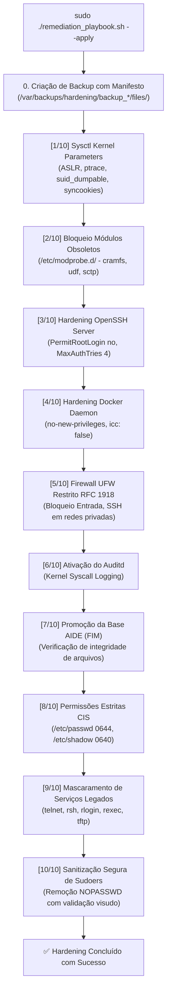

# 🛡️ Guia de Hardening, Logs e Rollback

Este documento descreve a arquitetura, as etapas operacionais, a estrutura de logs, o formato dos backups auxiliares e o mecanismo de reversão (*rollback*) disponibilizado pela plataforma para remediação e blindagem de sistemas Linux.

---

## 🎯 1. Princípios de Design do Hardening

1. **Idempotência Total**: A execução múltipla do script não duplica regras e não corrompe arquivos de configuração.
2. **Defesa em Profundidade (*Defense in Depth*)**: Aplicação de camadas de controle no Kernel, pilha de rede, controle de acesso, integridade de arquivos, firewall e contêineres.
3. **Não-Bloqueante**: Operações intensivas (como o cálculo de hashes do AIDE) são disparadas de forma segura em segundo plano (`-y -f -b`), permitindo conclusão do script em segundos.
4. **Preservação de Acesso e Serviços Corporativos**:
   - As regras de firewall protegem contra acessos externos da internet, mas liberam conexões originadas no host (*stateful conntrack*) necessárias para ferramentas como **Palo Alto Cortex XDR**, **Microsoft Teams**, **Microsoft Outlook** e navegadores.
   - O acesso SSH é restrito exclusivamente às redes privadas da **RFC 1918** (`10.0.0.0/8`, `172.16.0.0/12`, `192.168.0.0/16`).
5. **Rastreabilidade e Segurança**:
   - Todo comando executado gera registro com timestamp em `/var/log/hardening/`.
   - Antes de modificar qualquer arquivo, um snapshot com permissões originais é preservado em `/var/backups/hardening/`.

---

## ⚙️ 2. As 10 Etapas do Processo de Hardening



### Detalhamento das Etapas:

| Etapa | Arquivo / Alvo | O que é Configurado |
| :--- | :--- | :--- |
| **1. Kernel Sysctl** | `/etc/sysctl.d/99-security-hardening.conf` | `fs.suid_dumpable = 0`<br>`kernel.randomize_va_space = 2`<br>`kernel.yama.ptrace_scope = 1`<br>`net.ipv4.conf.all.rp_filter = 1`<br>`net.ipv4.conf.all.send_redirects = 0`<br>`net.ipv4.ip_forward = 0`<br>`net.ipv4.tcp_syncookies = 1` |
| **2. Módulos Legados** | `/etc/modprobe.d/*.conf` | Desativação e blacklist de `cramfs`, `freevxfs`, `jffs2`, `hfs`, `hfsplus`, `udf`, `dccp`, `sctp`, `rds`, `tipc`. |
| **3. OpenSSH** | `/etc/ssh/sshd_config.d/01-security-hardening.conf` | `PermitRootLogin no`<br>`PermitEmptyPasswords no`<br>`MaxAuthTries 4`<br>`X11Forwarding no`<br>`ClientAliveInterval 300` |
| **4. Docker Daemon** | `/etc/docker/daemon.json` | `"icc": false`<br>`"no-new-privileges": true`<br>`"live-restore": true`<br>`"userland-proxy": false` |
| **5. Firewall UFW** | `/etc/ufw/` | `Default: deny (incoming), allow (outgoing)`<br>Regras explícitas liberando SSH (22/tcp) apenas para `10.0.0.0/8`, `172.16.0.0/12`, `192.168.0.0/16` e `127.0.0.0/8`. |
| **6. Auditd** | `/etc/audit/` | Ativação do serviço `auditd` para registro de eventos de segurança no Kernel. |
| **7. AIDE (FIM)** | `/var/lib/aide/aide.db` | Promoção e geração em background de assinaturas SHA-256 de binários críticos. |
| **8. Permissões CIS** | `/etc/passwd`, `/etc/shadow`, `/etc/sudoers` | `/etc/passwd` (0644 root:root)<br>`/etc/shadow` (0640 root:shadow)<br>`/etc/sudoers` (0440 root:root) |
| **9. Serviços Legados** | `systemd units` | Mascaramento definitivo de `telnet`, `rsh`, `rlogin`, `rexec`, `tftp` e `nis`. |
| **10. Sudoers Sanitization** | `/etc/sudoers.d/*` | Substituição segura de `NOPASSWD:` por autenticação obrigatória de senha, testada com `visudo -c -f`. |

---

## 📁 3. Estrutura de Diretórios de Logs e Backups

### 📄 Logs de Execução:
- **Diretório:** `/var/log/hardening/`
- **Arquivo da sessão:** `hardening_YYYYMMDD_HHMMSS.log`
- **Link simbólico mais recente:** `hardening-latest.log`

### 📦 Snapshots de Backup Auxiliares:
- **Diretório base:** `/var/backups/hardening/`
- **Estrutura de cada snapshot:**
  ```text
  /var/backups/hardening/backup_20260818_170000/
  ├── manifest.json                 # Metadados do host, data e status
  └── files/                        # Estrutura espelhada dos arquivos originais
      └── etc/
          ├── sysctl.d/
          ├── ssh/
          ├── docker/
          ├── modprobe.d/
          └── sudoers.d/
  ```

---

## ⏪ 4. Como Executar o Rollback (Reversão)

### 1. Listar Backups Disponíveis no Sistema
```bash
sudo /home/danielgoncalves/hardening.sh --list-backups
```
*Saída:*
```text
========================================================================
 📦 Backups de Hardening Disponíveis 
========================================================================
 • backup_20260818_170000 | Arquivos salvos: 8 | Criado: 2026-08-18 17:00:00
 • backup_20260818_160942 | Arquivos salvos: 6 | Criado: 2026-08-18 16:09:42
```

---

### 2. Rollback Geral (Reversão Completa)
Restaura o sistema para o estado imediatamente anterior:

```bash
# Reverte a partir do snapshot mais recente
sudo /home/danielgoncalves/hardening.sh --rollback

# Ou reverte a partir de um snapshot específico
sudo /home/danielgoncalves/hardening.sh --rollback backup_20260818_160942
```

---

### 3. Rollback Granular por Componente
Permite reverter apenas um serviço específico sem afetar os demais controles:

```bash
# Reverter apenas as regras do OpenSSH:
sudo /home/danielgoncalves/hardening.sh --rollback-comp ssh

# Reverter apenas os parâmetros do Kernel Sysctl:
sudo /home/danielgoncalves/hardening.sh --rollback-comp sysctl

# Reverter apenas a configuração do Docker daemon:
sudo /home/danielgoncalves/hardening.sh --rollback-comp docker

# Reverter apenas o bloqueio de módulos de kernel:
sudo /home/danielgoncalves/hardening.sh --rollback-comp modules

# Reverter apenas as regras de Sudoers:
sudo /home/danielgoncalves/hardening.sh --rollback-comp sudoers
```
